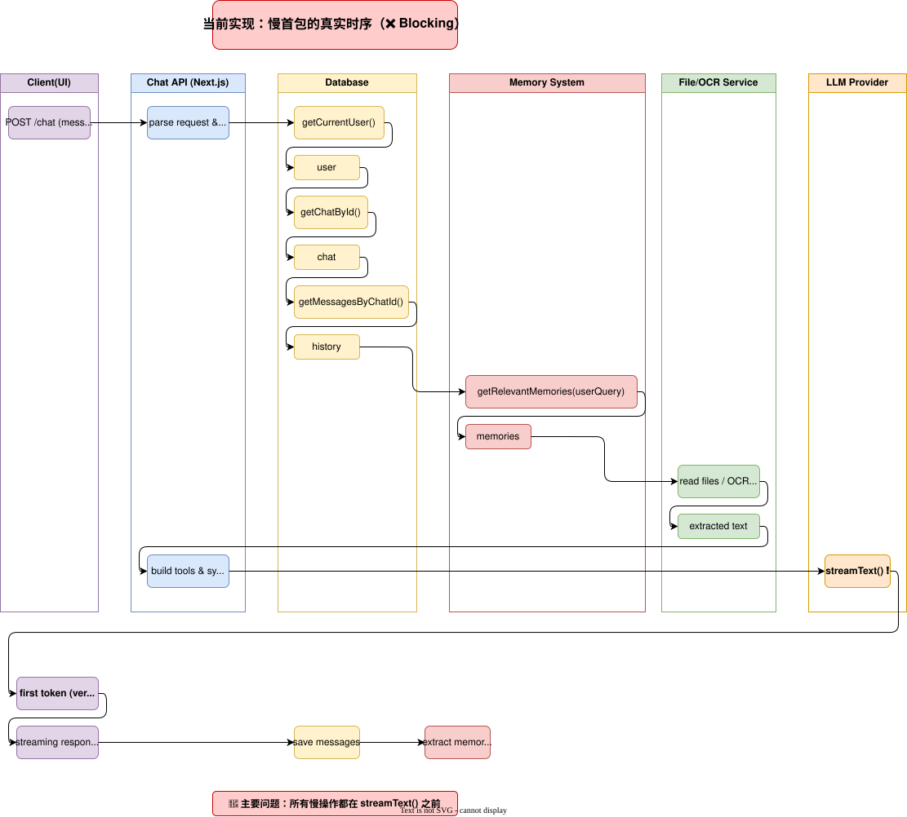

# 文档驱动系统概述

这是**z0 Agent** *0.3.8 -> ... -> 0.4* 我想要添加的功能

## plan 概述

这里我们想要实现的效果类似于Cursor编辑器以及Kiro编辑器在完成相对复杂工作时候的效果

### kiro的具体实现

这里进行一个简单的举例：当kiro在完成一个大型复杂模块or项目的时候，会进入到文档模式：
编写三篇文档：

1. requirements.md 这将会把用户的需求进一步扩展，但仍然是用户最原始的需求，不带有任何技术成分，比如：作为用户我希望程序是什么样子的
2. design.md 这里AI将会进一步扩展具体用户需求到实际实现步骤，这里会进行两步：
   1. 具体需求到实际技术实现 -> 或者是伪代码，示例代码的实现，以及示例的数据结构类型，每一个需求具体实现的细节都会予以标记序号（这将会在下一步中使用）
   2. 系统会进行反思，这里的反思由kiro的解释具体为：属性是系统在所有有效执行中应保持为真的特征或行为——本质上是关于系统应该做什么的正式陈述。属性作为人类可读规范和机器可验证正确性保证之间的桥梁。
3. task.md 这一步将会根据实际的需求，具体按照系统的复杂度以及用户的需求安排合理的任务，并开始执行

### Cursor编辑器的具体实现

cursor的编辑器相对比较简单一些，会直接列举一个简单的计划列表（类似于Todo plan），然后直接按照计划列表节点一步一步执行（但根据实际执行结果，我猜测和上下文工程应该也有关系，实际对上下文进行了操作才会导致这样的功能即使简略也会输出准确）

cursor目前使用最佳贴合实际应用的模型是claude 4.5 opus, 具体是否有claude skill类似的实现也不清楚

### v0的具体实现

v0我想具体更体现了以文档为中心的vibe coding思想，但我认为其中一定包含上下文工程的思维
这里好玩的一点是，我认为有这么一个功能对于和同性质的z0平台来说是相符的，也就是当用户的一个需求对于应用来说是不完整的的时候，v0会引导用户进行需求补全，最后直到确认完整的需求文档再开始进行计划：我认为这是最贴合在线vibe coding这种不适合大工程，快速搭建原型，满足用户需求的应用

## 在z0系统上的具体实现

首先我们大概需要做两件事：一个就是要搞一套文档引擎系统出来，至于这个文档系统的话应该只是存在于一个临时作用域里，因为临时性很强，所以肯定不需要用vectorDB去存
又得防止堆上下文，所以我们最好的一种情况就是设计一个单文档结构来驱动就行了
在任务引擎上，可以使用主agent启动子agent的方式，子agent调用`streamObject`那个方法去处理结构化数组然后最后一个结构体做summary去总结内容，大概至少有个

- 首先肯定要结构化
- 体积要小，要精辟一些
- 不需要解释和润色内容
- 包含新的事实，约束，依赖，状态标记

这里我们统称这些内容为让子Agent至少产出一个**最小可用事实**

然后另外做的一套东西就是文档完善工具，万一用户就放了一个屁就回车了怎么办，用户想做个博客，就放了个
“给我做个博客”，么了！

交互式文档完善工具主要体现在前端的交互上，这里AI需要调用工具生成一道问题让用户去回答，并且用户回答完成后再反馈到上下文中，最后上下文总结出来一篇需求文档（requirements.md或者design.md）

接下来生成最终的task.md，然后Agent再通过拆分大任务到小的节点里分层堆积上下文，就解决掉了上下文的问题
算是一个简单的上下文工程吧只能说

### 更加更加具体的实现

首先要做一个和本文档系统无关的事情，就是不能再搞模型列表了，我们也学v0，但是我没没有自己的模型，那就藏起来
叫这：
z0 mini
z0 pro
z0 max
然后走一套具体的扣费实现，模型走内部调度去吧
这样z0智能体本身就可以拆出来了，我们可以做一套内置基本工具，让他真正意义上成为一个单蹦的智能体，这才是真正的z0 core!
（but但是从今往后就得多开一个服务了呜呜）

然后我们需要对智能体的加载（从客户端拉取逻辑后到服务端的处理）（现在很卡得半天才能跑完）好好的整顿一下，多尝试并发并行异步之类的，每次发起对话都得等半天这肯定有猫病好吧

我现在的想法就是实现一个类似的服务器状态去做用户校验balabala之类的，暂时没有思路 这里先看看GPT的实现吧

